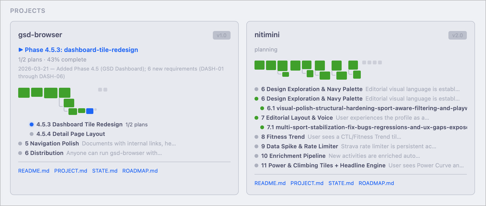

# gsd-browser

A local markdown server for browsing the living documentation that AI agents continuously create across your repos.

Point it at your repos, and get a clean UI to navigate `.planning/`, `docs/`, and other markdown-heavy directories — always serving the current file from disk, never a stale cache.

## Why

AI coding tools like [GSD](https://github.com/stonematt/get-shit-done-cc) produce rich `.planning/` artifact trees — roadmaps, phase plans, research docs, state files, verification reports. These files are actively written and updated during development. gsd-browser gives you a way to read them without context-switching out of your workflow.

## Features

- **Multi-repo source registration** — register any number of repos or paths; browse them all from one UI
- **Convention-based discovery** — `.planning/`, `docs/`, and `README.md` are auto-discovered in registered repos
- **GSD project dashboard** — card-style summaries for every GSD project with phase progress, editorial context, and branch awareness
- **Phase timeline drill-down** — click into a project to see completed/in-progress/pending phases with plan metadata and requirement badges
- **Multi-branch support** — for git repos with multiple branches containing `.planning/`, view per-branch milestone progress
- **Fresh-from-disk rendering** — every page load reads from the filesystem; no caching, no stale content
- **GFM markdown** — tables, task lists, fenced code with syntax highlighting (Shiki), footnotes, strikethrough
- **Mermaid diagrams** — rendered server-side as SVG, no client-side JavaScript required
- **Dark theme** — GitHub-dark palette, designed for developers

## Quick start

```bash
npx gsd-browser
```

Or install globally:

```bash
npm install -g gsd-browser
gsd-browser
```

### Register sources

```bash
# Add a repo (auto-discovers .planning/, docs/, README.md)
gsd-browser add ~/src/my-project

# Add with a custom name
gsd-browser add ~/src/my-project --name "My Project"

# List registered sources
gsd-browser list

# Remove a source
gsd-browser remove my-project
```

### Start the server

```bash
# Default: localhost:3000
gsd-browser

# Custom port
gsd-browser --port 4242
```

Open `http://localhost:3000` (or your custom port) in a browser.

## What you'll see



**Dashboard** — project cards showing milestone progress, current focus, phase dot strips, and quick-links to key planning documents.

**Project detail** — phase timeline with completed/active/pending phases, file sidebar with plan/summary/research classification, and a content pane rendering the selected document with structured metadata cards for plan files.

**File browser** — tree navigation for any registered source, with rendered markdown in the content pane.

## Stack

- **Runtime:** Node.js 20+
- **Server:** Fastify 5
- **Rendering:** markdown-it 14 + Shiki 4 (syntax highlighting) + Mermaid 11 (diagrams, server-side SVG)
- **Frontend:** Vanilla JS single-page app (no build step)
- **Config:** XDG-compliant config persistence (`~/.config/gsd-browser/`)

## Security

- Binds exclusively to `127.0.0.1` (localhost only)
- Path traversal protection via `fs.realpath()` boundary checks
- Content-Security-Policy headers on all responses
- Read-only — never modifies source files

## Development

```bash
git clone https://github.com/stonematt/gsd-browser.git
cd gsd-browser
npm install
npm test
node bin/gsd-browser.cjs --port 4242
```

## License

[MIT](LICENSE)
